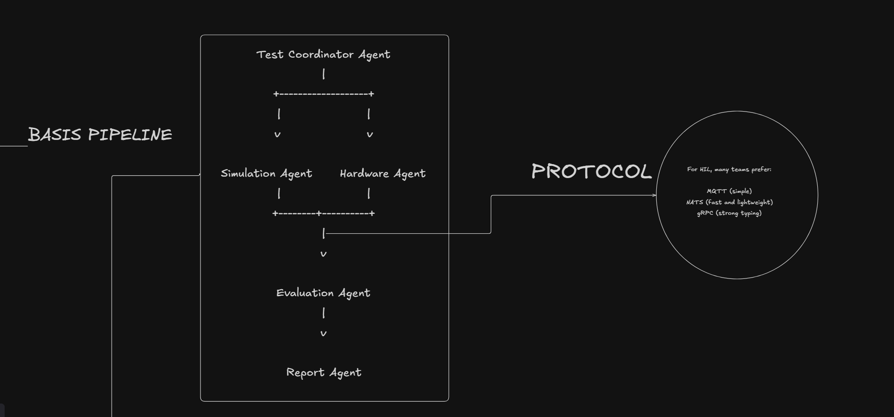
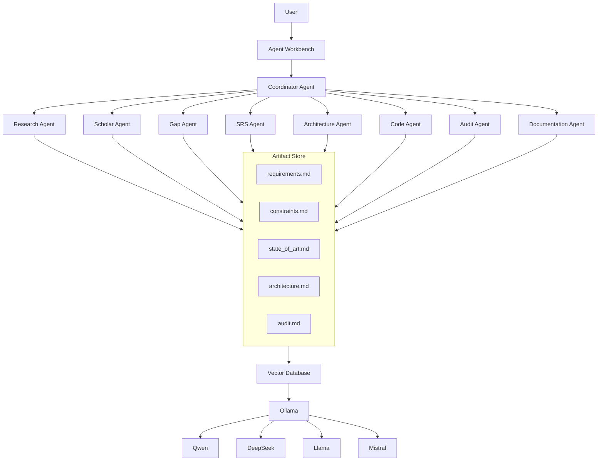

# Aether — Agent Engineering Workbench

**Signal Processing and Recognition Group (SPRG)**

---

A local-first, multi-agent operating environment where users upload documents, repositories, ideas, papers, requirements, or research topics, and dynamically assemble specialized agents to analyze, generate, audit, research, code, and continuously update project artifacts.

---

## Main Goal

_Develop an agent engineering platform capable of orchestrating specialized AI agents — locally or hosted — that follows a full pipeline from research and requirements through architecture, implementation, audit, and deployment._

---

<details>
<summary>REQUIREMENTS</summary>

- **FIRST DEFINE REQUIREMENTS:**


```
# Define Logical Non-Functional Constraints

such as :


Expected throughput (specific output (files, raw text, project orchestation) )


Retention policy (e.g., raw data 6 months)

```

</details>

---

<details>
<summary>Project & System Architecture</summary>

We apply the **conceptual → logical → physical** model to guide development of a general-purpose agent engineering platform.


The system is designed as agent orchestration architecture:


### Agent System Architecture



```bash 
Your App (user) 
    requires 
    │
    ▼

Coordinator

    │

    ├── Research Agent
    ├── Code Agent
    ├── Audit Agent
    └── Documentation Agent

    │

    ▼

Ollama

    │

    ▼

Qwen / DeepSeek / Llama

    (output) 

    
```

Every agent writes to and reads from the **Artifact Repository** — the single source of truth.

```
Artifacts = Truth
Agents are disposable. Documents are persistent.
```

### project orchestation

```bash
agent-workbench/

├── apps/
│   ├── desktop/
│   └── web/
│
├── backend/
│   ├── api/
│   ├── services/
│   └── workflows/
│
├── agents/
│   ├── research/
│   ├── scholar/
│   ├── gap/
│   ├── requirements/
│   ├── architecture/
│   ├── code/
│   ├── audit/
│   └── documentation/
│
├── artifacts/
│   ├── research/
│   ├── requirements/
│   ├── architecture/
│   ├── audits/
│   └── generated/
│
├── models/
│   ├── prompts/
│   └── ollama/
│
├── vector_db/
│
├── infrastructure/
│   ├── docker/
│   └── deployment/
│
├── docs/
│
├── tests/
│
└── scripts/

 ```

</details>

---


<details>
<summary>Conceptual Design</summary>

### High-Level Vision

Develop an agent orchestration platform capable of:

- **Orchestrating multi-agent workflows**
    - _research_ (scholar, gap analysis, state of art)
    - _code generation_ (architecture, repository scaffold, implementation)
    - _audit_ (security, architecture, testing, technical debt)
    - _documentation_ (SRS, requirements, markdown, latex)
- Receiving and processing user inputs (documents, repos, ideas, papers, problems).
- Persisting all outputs as versioned artifacts in a knowledge repository.
- Supporting dynamic agent selection based on task requirements.
- Enabling local-first, air-gapped operation with optional cloud model fallback.

### High-Level Processing Flow

```
→ Receive user input (text, files, repo, idea)
→ Coordinator LLM classifies intent
→ Dynamically select and chain agents
→ Each agent reads/writes artifacts
→ Review quality gate → iterate if needed
→ Deliver final artifact set (markdown, code, docs)
→ Index into vector database for future context
```

### Inputs

The system accepts:

```
PDF, DOCX, TXT, Markdown, Git repositories, ZIP projects,
Images, Research papers, Requirements, Ideas,
Problem statements, Hardware specifications, Standards
```

### Example Usage

**Usage 1 — Research Discovery:**

User uploads 20 papers and asks "Find a research opportunity."

Coordinator launches: Document Agent → Research Agent → Gap Agent → Problem Statement Agent → Methodology Agent

Outputs: `state_of_art.md`, `gaps.md`, `problem_statement.md`, `objectives.md`, `methodology.md`

**Usage 2 — Code Audit:**

User uploads a Git repository and asks "Audit the code."

Coordinator launches: Repository Analyzer → Security Auditor → Architecture Auditor → Testing Auditor

Outputs: `audit_report.md`, `security_findings.md`, `technical_debt.md`, `recommendations.md`

**Usage 3 — Scientific Innovation:**

User uploads hardware specs and writes "Find an innovation opportunity in spectrum monitoring."

Coordinator launches: Research Agent → Scholar Agent → Gap Agent → Innovation Agent → Project Agent

Outputs: `innovation_candidates.md`, `constraints.md`, `requirements.md`, `research_gaps.md`, `project_definition.md`


**Usage 4 — Project Bootstrap / Software Factory:**

User writes "Create a local-first multi-agent platform for research and software development."

Coordinator launches: Requirements Agent → Architecture Agent → Repository Agent → Technology Stack Agent → Implementation Planner Agent → Documentation Agent

Outputs: `architecture.md`, `constraints.md`, `requirements.md`, `.env.example`, `docker-compose.yml` 


### Software View

Core logical agents (conceptual level for the general system):

- **FRAMEWORK**

Services implemented as microservices:


At this stage, we define _what components exist_ and _their responsibilities_, not the implementation details.

### Database View

Entity-Relationship model using an specific database (normal and vectorized)

Main entities:

---

Relationships:

---

### API View

API interaction categories:

- **Ingestion** — Task submission, request validation, artifact intake and versioning.
- **Monitoring** — Filter by range, node or any other index.
- **Alert** — Notification and detection management.
- **Administration** — Register or update info, manage users.

Capabilities:

- `register nodes`
- `send data`
- `consult data`
- `consult data`

_Example: ML Microservice_


</details>

---

<details>
<summary>Logical Design</summary>

### Formal Model

Agents achieve their responsibilities through a coordinator-driven event architecture.

**Logical architecture style: Event-Driven Agent Architecture** with dynamic agent selection, artifact persistence, and model-agnostic execution.

**Pipeline:**

```
User Input → Coordinator LLM → Agent Selection → Agent Execution → Artifact Repository → Vector DB → Knowledge Base
```

**Where does orchestration happen?**

- A) On the Coordinator LLM (dynamic routing)
- B) On the Agent Runtime Layer (CrewAI / AutoGen / LangGraph)
- C) On the Edge (local-first, air-gapped)

**Best logical decision:** Coordinator decides routing → runtime executes → artifacts persist. The coordinator is stateless; agents are disposable; artifacts are the source of truth.

**Parallel Branches:**

```
COORDINATOR → Research Branch → Scholar Agent → Gap Agent → Innovation Agent
           → Software Branch → Architecture Agent → Code Agent → Audit Agent
           → Documentation Branch → SRS Agent → Markdown Agent → Latex Agent

ARTIFACT REPOSITORY → Vector DB → Model Context → Coordinators next decision

FRONTEND → Coordinator API → WebSocket for real-time agent streaming
```

### Software View

Refinement into structured agent pipeline components:

- `analyze_input(request, context)` — Parse user intent and available artifacts
- `select_agents(coordinator, task)` — Dynamic agent assembly by coordinator
- `execute_workflow(agent_chain, artifacts)` — Run agents sequentially or in parallel
- `produce_artifact(output, type)` — Persist structured markdown artifact
- `update_knowledge_base(artifact, vector_db)` — Index into vector database
- `review_and_iterate(artifacts, threshold)` — Loop until quality criteria met
- `generate_deliverable(outputs, format)` — Produce final output (markdown, repo, doc)

**Coordinator Agent:** Central LLM that interprets user intent and dynamically assembles agent teams.

- Intent parsing: classify user request into research, code, audit, or documentation mode.
- Agent routing: select, order, and parameterize agents for the task.
- Quality control: review artifacts and decide if iteration is needed.

**Agent Runtime:** Pluggable execution layer that runs agents.

```
USER REQUEST → COORDINATOR → AGENT RUNTIME → AGENT CHAIN → ARTIFACT STORE → VECTOR DB → KNOWLEDGE BASE
```

Standard input schema (JSON serialized):

```json
{
  "version": "1.0",
  "mode": "research",
  "context": {
    "project": "adsb-interference",
    "goal": "Find research opportunities"
  },
  "inputs": [
    {"type": "pdf", "path": "papers/2024_survey.pdf"},
    {"type": "md", "path": "requirements.md"}
  ],
  "artifacts": ["state_of_art.md", "gaps.md"]
}
```

**Agent Runtime Services:**

- `ResearchService` — Orchestrates Scholar, Gap, and Innovation agents.
- `CodeService` — Manages Code Generator, Repository Auditor, Test Generator.
- `AuditService` — Coordinates Security, Architecture, and Testing auditors.
- `DocumentationService` — Runs Markdown, Latex, and SRS documentation agents.
- `Orchestrator` — Coordinator logic, artifact routing, quality gates.

### Database View (Relational Schema)

_PostgreSQL + Vector Database (Chroma/Qdrant)_ as dual storage. Relational for metadata and workflows; vector for semantic retrieval.

**Tables:**

- `Project(id, name, description, created_at, status)`
- `Agent(id, name, role, model, runtime, config)`
- `Workflow(id, project_id, coordinator_id, status, started_at, completed_at)`
- `WorkflowStep(id, workflow_id, agent_id, input_artifacts, output_artifact, status)`
- `Artifact(id, workflow_id, step_id, type, path, hash, created_at)`
- `KnowledgeEntry(id, artifact_id, vector_id, summary, tags)`
- `User(id, name, email, role)`
- `AgentModel(id, name, provider, local_path, parameters)`

**Key elements:**

- Projects contain multiple workflows.
- Workflows chain agents through sequential or parallel steps.
- Each step produces artifacts that feed subsequent steps or the knowledge base.
- Vector entries link to markdown artifacts for semantic retrieval.
- Every agent can use a different model.

**Partitioning:** `Artifact_2026_x` by project scope

<details>
<summary>ER DIAGRAM</summary>


</details>

### API View — Logical Scaling Strategy

High availability requires:

- **Stateless Coordinator API**
- **Replicated Artifact Repository**
- **Distributed Agent Runtime pool**
- **Horizontal scaling of agent workers**
- **Multiple coordinator instances**
- **Consumer groups for agent task queues**
- **Read replicas for knowledge queries**

**API Endpoints (example):**

**COORDINATOR:**
- `POST /api/workflow/run` — Submit user request, returns workflow ID
- `GET /api/workflow/{id}/status` — Poll workflow progress
- `GET /api/workflow/{id}/artifacts` — List generated artifacts
- `POST /api/workflow/{id}/cancel` — Cancel running workflow

**AGENTS:**
- `GET /api/agents` — List available agents
- `POST /api/agents/select` — Manually select agents for a task
- `GET /api/agents/{id}/capabilities` — Describe what an agent does

**ARTIFACTS:**
- `GET /api/artifacts` — List all artifacts with filters
- `GET /api/artifacts/{id}` — Retrieve artifact content
- `POST /api/artifacts` — Manually inject an artifact
- `GET /api/artifacts/search?q=...` — Semantic search via vector DB

**KNOWLEDGE:**
- `GET /api/knowledge` — Browse knowledge base
- `POST /api/knowledge/index` — Re-index artifacts into vector DB

**Backend:** FastAPI + Python → React

**Communication model:**
- Transport: `HTTP/2` / `WebSocket`
- Protocol: `REST` / `SSE` for streaming
- Serialization: `JSON`
- Schema: `ArtifactMessage` (versioned)

**Architectural pattern:**
- `REST endpoints` for sync operations
- `Event streaming channel` (Redis / Kafka) for agent task queues
- `Server-Sent Events (SSE)` and `WebSocket` for real-time agent output streaming

**Frontend Modules:**
- Workflow Dashboard, Agent Console, Artifact Explorer, Knowledge Graph, Admin
- **React Services:** API Client, SSE Stream, WebSocket, Auth

### Agent Runtime Layer

```
Coordinator Layer
        │
        ▼

Agent Runtime Layer

 ├── CrewAI
 ├── AutoGen
 ├── LangGraph
 ├── OpenAI Agents
 ├── Ollama Agents
 └── Custom Agents
```

### Model Layer

Every agent can choose a different model:

```
Research Agent      → GPT / DeepSeek
Code Agent          → DeepSeek / Qwen
Auditor             → Claude
Documentation       → Llama / Mistral
Local Agent         → Qwen (Ollama)
```

Knowledge is maintained via:
- Markdown artifacts
- Vector Database (Chroma / Qdrant)
- Metadata & Version History

</details>

---

<details>
<summary>Physical Design</summary>

### Implementation

_Provide a real code implementation of the system along with comprehensive process documentation to ensure clarity, reproducibility, and maintainability._

<details>
<summary>API</summary>

Full system implementation by layers:
1. Coordinator API (FastAPI)
2. Agent Runtime (CrewAI / AutoGen)
3. Artifact Repository (Markdown + Git)
4. Vector Database (Chroma / Qdrant)
5. Frontend (React)
6. Model Layer (Ollama / Cloud APIs)

### Software View

Write the API REST code and document. Real code implementation (Python, C++, Angular, API REST, etc.) with modularization, memory optimization, and backend integration.

#### Database View

Store and manage relational data using PostgreSQL. Physical deployment includes:
- Creating tables and collections.
- Adding indexes for fast queries.
- Security configuration and API communication.
- Scalability strategies (sharding, replication).

#### API View

- **Backend Agent:** Handles storage, memory and communication with an API REST.
- **Frontend Agent:** Visualization and user request management on Angular.
- **Communication Agent:** Protocol management between API and data using HTTP.
- **Microservices Agent:** Managerial requirements applied and maintained.

</details>

---

<details>
<summary>Hardware Implementation</summary>

 implementation details. Hardware deployment notes (guide system model).

</details>

---

<details>
<summary>CODE</summary>

1. **Prepare environment** for system management and deployment:
   - Python 3.11+ / FastAPI
   - Ollama (local models)
   - Git / Docker
   - Node / React

2. **Coordinator API:**
   - Create FastAPI project
   - Define workflow orchestration endpoints
   - Agent selection and routing logic
   - Artifact I/O handlers
   - _Test:_ unit test, integration test

3. **Agent Runtime integration:**
   - CrewAI pipeline setup
   - Agent definitions (Research, Code, Audit, Documentation)
   - Tool registration and model binding
   - Artifact read/write hooks
   - _Test:_ run sample workflows end-to-end

4. **Vector Database:**
   - Chroma / Qdrant setup
   - Artifact indexing pipeline
   - Semantic search over artifact repository
   - _Test:_ query accuracy, retrieval latency

5. **Frontend:**
   - Create React project
   - Workflow submission UI
   - Real-time agent output streaming (SSE)
   - Artifact explorer and knowledge graph
   - _Test:_ manual test, integration test

</details>

</details>

---

<details>
<summary>Deployment Strategy</summary>

### Phase 1 — Local (3-4 weeks)

```
FastAPI + CrewAI + Ollama + Markdown artifacts
```

Local only. No Electron. No fancy frontend. Just prove the workflow.

### Phase 2 — Web UI

```
React + FastAPI + CrewAI + Ollama
```

Hosted in lab environment: `192.168.x.x:8000` for the Signal Processing and Recognition Group.

### Phase 3 — Desktop Application

```
Electron + React + FastAPI + Ollama
```

Produces: `AetherWorkbench.exe` / `Aether.app`

### Phase 4 — Multi-User Platform

```
Professor | Researcher | Student
Shared artifact repository
```

Collaborative multi-user environment with role-based access.

### Deployment Modes

**Mode 1 — Desktop (Electron):**
```
Electron + React + FastAPI + CrewAI + Ollama
```
Target: Researchers, Professors, Students, Engineers

**Mode 2 — Local Network Service:**
```
FastAPI + CrewAI + Ollama + Docker
```
Researchers connect through `http://192.168.1.100:8000` and use agents collaboratively.

### Proposed Final Architecture

```
                     USER
                       │
                       ▼
              Coordinator LLM
                       │
  ┌──────────────────────────────────┐
  │                                  │
  ▼                                  ▼

Research Domain               Software Domain

Scholar Agent                Architecture Agent
Gap Agent                    Code Agent
Problem Agent                Audit Agent
Innovation Agent             Test Agent
  │                                  │
  └──────────────┬───────────────────┘
                 │
                 ▼
        Artifact Repository

 requirements.md     constraints.md
 state_of_art.md     architecture.md
 methodology.md      repository.md
 audit.md            codebase/
                 │
                 ▼
      Local Models / Cloud Models

 GPT / Claude / DeepSeek / Qwen / Llama / Mistral
                 │
                 ▼
          Deployment Layer

 Electron Desktop  or  Local Network Server (SPRG)
```

</details>

---

<details>
<summary>Finalization Conditions</summary>

The task is considered complete when:

- API endpoints return accurate and structured data.
- Database integrity constraints are verified.
- Documentation includes:
  - ER diagram.
  - Architecture diagram.
  - API endpoint specification.
  - Deployment instructions.
- Load testing confirms the system supports concurrent node transmissions.
- Agent orchestration pipeline produces verifiable artifacts.

</details>

---

<details>
<summary>Prototype</summary>





</details>

---

## Knowledge Layer

```
knowledge/
├── requirements.md
├── constraints.md
├── state_of_art.md
├── architecture.md
├── audit.md
└── codebase/
```

Every agent reads from here. Every agent writes here. This is the persistent memory of the platform.

---

## Technology Stack

| Layer | Technology |
|-------|-----------|
| **Backend** | FastAPI |
| **Agent Runtime** | CrewAI, AutoGen, LangGraph |
| **Local Models** | Ollama (Qwen, DeepSeek, Llama, Mistral, Gemma, Phi) |
| **Cloud Models-OPTIONAL** | GPT, Claude |
| **Vector DB** | Chroma / Qdrant |
| **Frontend** | React / Angular |
| **Desktop** | Electron |
| **Database** | PostgreSQL-SQLite |
| **Broker** | Kafka / RabbitMQ |
| **Artifact Store** | Git + Markdown |

---

## License

SPRG — Signal Processing and Recognition Group
