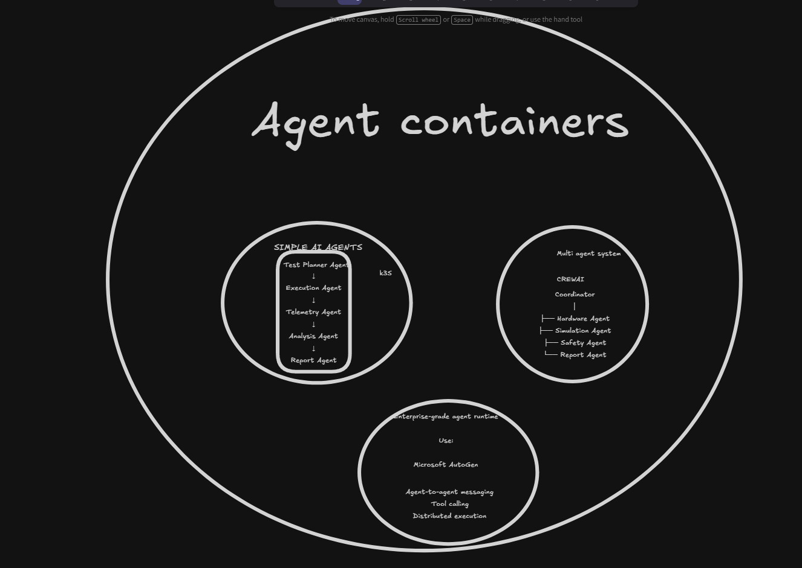
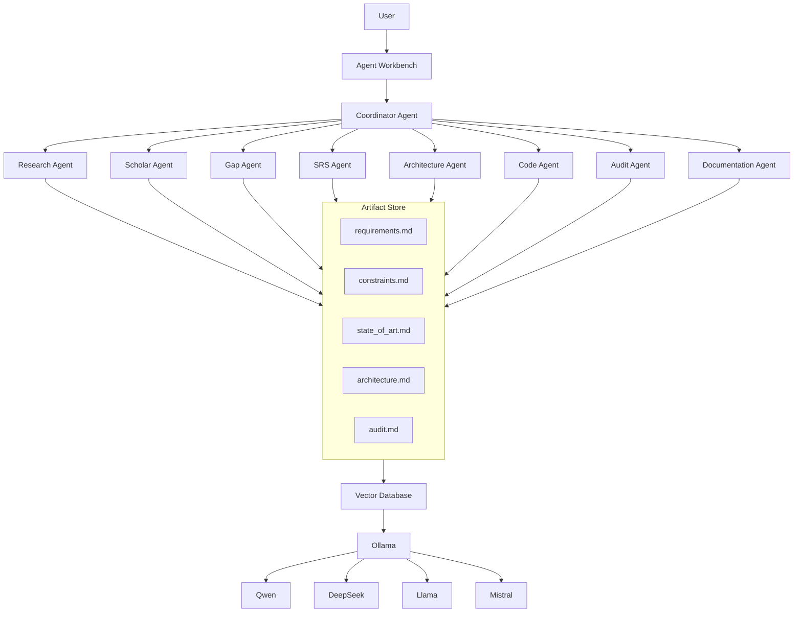

# pipeline

Backend:
FastAPI

Agent Runtime:
CrewAI

Models:
Ollama

Main Models:
Qwen 3
DeepSeek
Llama

Then:

Vector Database

+
Artifact Repository

+
Research Pipeline


# goals: 


- given some documents 

    - make the research pipeline : 


- made it one document for each section to catch and track progress. 

    - this absolves the allucination 
    
- one agent its capable of : 
    - - review the software made it 

            - and UPDATE  > what we : have to update. 


- restricciones a las soluciones ; dado un problema especifico

- each phase or agent : 
    - should made a file for each step for the pipeline 

        - this has to be iterative for deep on each one of the record 
 

## agent 1 

use google scholar to stay on the state of art

    - motivation : 
        - issues with the aviation monitory systems (on a bandwith we have interference)
            - this can : 
                - ommit some relevant info
                - act as some specific way (not want to)

    - ¿ a dónde llegar ? 
        - innovación científica para resolver el problema 
        - cual es la estructura básica de un problema a resolver
            - el objetivo es descubir que restricciones hay para dar solucion a este problema. 
                - CONSTRAINTS (GAPS)
                - REQUIREMENTS (srs phase)  
                    - given this constraints and requirements :
                        - obtain and approach for my trouble to fix
                            - this gimme a RIAL PIPELINE in order to start a convocatory project to fix an issue. 

                - planteamiento del problema  |
                - objetivos                   |-> and thats it. (THIS IS A FULL PIPELINE)
                - metodología                 |

## agent 2 

- codifier


## agent 3 

- hardware inference and helpper 


## agent 4 

- sofwtare inference and helpper for users / clients


# reference diagrams: 



manage multiple agents in order to achieve some tasks, such as, TEX CREATION, CODE CREATOR, CODE AUDITER, INFORMATION HELPPEER... the main idea its is that this should be manage by a LLM , such as  just entry to the app and then, center the app on the right path, and from here, that the user could be select our add some files (pdf, txt, docx, de todo) , nosotrosconvertirlos a markdown para procesarlos , y de aqui, obtener una estructura base de repositorio, un codigo auditado de repositorio, informacionm sobre gaps, problem statement, full pipeline or resarchs innovations... EACH OF THOSE OUTPUTS from a DOCS reference, should it BE THE ENTER FOR ANOTHER AGENT, CAPABLE OF TAKE THIS ENTRY AND REVIEW THE CODE, AUDIT, AND ALSO CREATE SOME BASIS REFENRECE TO START THE DEVELOP... THEN, ANOTHER AGENT CAPABLE OF TAKE THIS DOCUMENTS OF SOFTWARE BASIS, AND START AN SPECIFIC WORKFLOW AND DELVIVER A FULL PIPELINE TO IMP´LMEENT THE IDEA ON SOFTWARE... could it be many others users, but this are some of those... 


# final prototype 


```bash 
Your App (user) 
    requires 
    │
    ▼

Coordinator

    │

    ├── Research Agent
    ├── Code Agent
    ├── Audit Agent
    └── Documentation Agent

    │

    ▼

Ollama

    │

    ▼

Qwen / DeepSeek / Llama

    (output) 

    
```

## diagram

